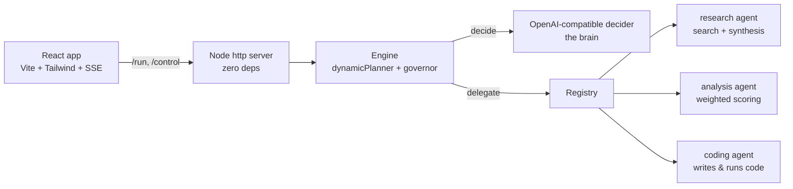

# AgentCompose Playground

A **web playground** for exercising the [AgentCompose](https://github.com/agentcompose)
contract at **two altitudes**, with a **real model** and **real agents** — a polished
**React** front end over a **zero-dependency Node backend**. It is two things at once:

1. **The long-life testing harness** — drive either the master engine or a single
   worker, watch it plan → delegate → stream, approve/deny governed steps (HITL), and
   judge whether the orchestration (and each component) is actually valuable.
2. **The seed of product layer ④** — the first concrete UI on top of the headless
   engine *and* the SDK substrate, and the first external consumer that exercises both
   public package surfaces.

## Two modes (one contract)

Because every AgentCompose agent shares the same interaction surface
(`describe / configure / submit / events`), a **master** and a **worker** are the same
kind of thing. The playground makes that tangible with a mode toggle:

| Mode | What it drives | How |
|------|----------------|-----|
| **Engine** (master) | the `Engine`: a goal is planned and delegated across the registry | `dynamicPlanner` + governor over the `decide` port |
| **Single agent** | one selected worker, directly | `AgentClient.configure()` → `submit()` → `events()`, bypassing the planner |

Both modes share the **same event stream and result UI** — single-agent `TaskEvent`s are
normalized server-side into the engine's `EngineEvent` vocabulary (a synthetic one-step
run), so the timeline, result panel, and event log work identically. In single-agent
mode you also get a **config form rendered from the agent's `configSchema`** — the
spec's "configurable component" claim made tangible (e.g. flip research's `clarify` knob
to trigger the input-required HITL standalone).

## Dynamic agent catalog

The registry is built from **one declarative catalog** ([`server/catalog.ts`](server/catalog.ts)):
each entry pairs a stable `name` with an `AgentDefinition`. Both the engine registries
and single-agent mode are derived from it, and the UI dropdown + roster are generated
from `/config`. **Adding an agent is a one-line change** in the catalog (plus a
dependency) — no edits to `server.ts` or the UI. (A *useful* addition is more than that
— see [**Adding an agent**](#adding-an-agent) below.)

> **On dependencies:** the *engine core* stays dependency-free by design. This is the
> *product* layer, so it uses a real stack — **Vite + React + TypeScript + Tailwind**
> for the UI — while the backend that wires the engine stays **zero-dependency**
> (Node's built-in `http` + Server-Sent Events, no framework).

It runs **real work**, not canned strings — the only honest way to evaluate the engine.
The worker agents are thin adapters at the right altitude:

| Agent | Wraps | Role |
|-------|-------|------|
| `research` | a deep-research loop — multi-angle search (pluggable: fixture / Tavily) + LLM synthesis, BYO-model | **gather** — real, cited findings |
| `analysis` | an LLM evaluator that scores options against weighted criteria | **decide** — deterministic ranking + recommendation |
| `coding` | [pi-coding-agent](https://www.npmjs.com/package/@earendil-works/pi-coding-agent) in a disposable workspace (read/write/run tools) | **build** — writes & runs real code |

Together they form the **gather → decide → build** spine of the app-making use case.

## Adding an agent

Registering an agent is a one-line change in [`server/catalog.ts`](server/catalog.ts) —
but a *useful* addition is more than registration. An agent that joins the roster should
ship with everything that makes it **demonstrable** and **judge-able**:

1. **Register it** — append a `{ name, def }` entry in `server/catalog.ts` (and add the
   package as a dependency). The engine registries, single-agent dropdown, roster, and
   config form are all derived from this; no edits to `server.ts` or the UI.
2. **Ship a few _powerful_ samples** in `web/src/components/Composer.tsx`
   (`AGENT_SAMPLES[<name>]`). **Not toys.** Each should exercise the agent's real
   behavior, tiered from a quick proof to a substantial run, and at least one should tie
   into the app-making use case (the 📱 samples). An agent with no samples is invisible
   to anyone evaluating it.
3. **Review the engine-mode goals** (`SAMPLES` in the same file). A new specialist
   changes what the master *can* coordinate, so revisit them: **add** a goal that routes
   to or chains the newcomer, and **drop/update** any that no longer reflect the roster.
   Keep the balance — coordinated (🔗/📱) goals that fan out across agents, **plus**
   selection (🎯) goals that prove the planner routes precisely and doesn't over-decompose.
4. **Keep the capability general.** Verticalize through composition and samples, not by
   specializing the agent. The agent stays a horizontal component; a concrete use case
   (e.g. app-making) is expressed in the *sample*, not baked into the worker.

> **Rule of thumb:** an agent is "added" when you can pick it from the dropdown, run a
> sample that shows it doing real work, **and** the master has at least one goal that
> uses it. Registration alone is necessary, not sufficient.

## Run

> **Requires Node ≥ 22.18** (the backend runs TypeScript via Node's native
> type-stripping, same as the engine/SDK). With nvm: `nvm use` (an `.nvmrc` pins 24).

```bash
# 1. install (@agentcompose/engine + sdk from npm)
npm install

# 2. build the web app once
npm run build

# 3. configure your key — either a .env file (recommended) or an inline env var
cp .env.example .env        # then edit .env and set OPENAI_API_KEY
npm start                   # loads .env automatically → http://localhost:5173

# ...or without a .env file:
OPENAI_API_KEY=sk-... npm start
```

`.env` is loaded natively by Node (`--env-file`), no `dotenv` dependency. It's
git-ignored. Supported keys are the same as the env vars below.

**Developing the UI** (hot reload) — two terminals:

```bash
OPENAI_API_KEY=sk-... npm start          # backend on :5173
npm run dev:web                          # Vite on :5174, proxies the API to :5173
```

Environment:

| Var | Default | Notes |
|-----|---------|-------|
| `OPENAI_API_KEY` | _(required)_ | drives the planner (brain) and the worker agents (BYO-model) |
| `OPENAI_BASE_URL` | `https://api.openai.com/v1` | any OpenAI-compatible endpoint / gateway |
| `OPENAI_MODEL` | `gpt-4o-mini` | the model id |
| `PORT` | `5173` | |

Try a sample goal (buttons in the UI), e.g. (engine mode):

> _Research the leading datastores for a write-heavy multi-tenant SaaS backend, then
> score them on write throughput, ops complexity, cost, and ecosystem and recommend one._

With **Govern coding** on, a run that reaches the coding agent **suspends** before any
code is written/run and waits for your Approve/Deny — that's the engine's durable
governor + HITL path made tangible.

## Is it valuable? — what to look for

| Watch for | The claim it tests |
|-----------|--------------------|
| Does the planner pick a sensible decomposition you didn't hand-script? | the engine is a real **brain**, not a fixed workflow |
| Swap one worker for another **without touching the engine** | "reusable component" composition is real |
| Tweak a worker's config (e.g. research's `angles`, analysis's `criteria`) and re-run | "configurable component" is real |
| Approve/Deny a governed `coding` step | governance / HITL is a feature, not a slogan |

## How it's wired



```
playground/
  server/          zero-dep Node backend (http + SSE)
    server.ts      engine wiring + single-agent runner + REST/SSE endpoints
    catalog.ts     declarative agent catalog (single source of truth)
                   workers come from @agentcompose/{research,analysis,coding}-agent
  web/             Vite + React + TypeScript + Tailwind front end
    src/
      hooks/useRun.ts     SSE stream → React state (mode-agnostic)
      components/         ModeToggle, Composer, ConfigForm, AgentRoster,
                          StepTimeline, ApprovalCard, ResultPanel, EventLog
```

## Known limitations (honest, deferred)

- **Durability is in-memory.** Resume works within a running process (HITL approval),
  but a process restart loses suspended runs. Cross-restart durability lands with the
  engine's persistence adapter (a separate, tracked engine item).
- **One governance policy** (approve `coding`). The governor seam supports arbitrary
  policies; the UI just exposes a single toggle for now.

## License

Apache-2.0.
